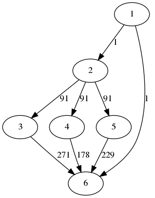

# Randomized Multi-DAG Generator for Scheduling and Allocation Research

**dag-gen-rnd** --- Randomized multiple Direct Acyclic Graph generator (DAG) designed for scheduling and allocation research in parallel and multi-core computing. 

**dag-gen-rnd** supports both command line (`daggen-cli`) and graphical user interface (`daggen-gui`). This generator can be easily configured through a `.json` file and is highly extensible for other purposes.

Supported generation algorithms:
- NFJ: Nested fork-join
- rnd: standard randomized DAG (layer-by-layer)
- rnd_legacy: default randomized DAG

---

## Requirements

- `Python >= 3.5`
- `NetworkX >= 2.4`
- `Matplotlib >= 3.1.3`
- `pygraphviz >= 1.5`
- `numpy >= 1.17`

---

## Installation on Linux

Install depedencies using apt:

`$ sudo apt install python3-dev graphviz libgraphviz-dev pkg-config`

and then install Python depedencies through `requirements.txt`:

`$ pip3 install -r requirements.txt`

(Optional) To use the GUI, you need to install Qt5 for python:

`$ sudo apt install python3-pyqt5`

---

## Configuration

Use the configuration file `config.json` to configure parameters.

---

## Usage

First, change the configurations in `config.json`. Then, depending on your perference:

### 1. Use the command line interface

`$ python3 src/daggen-cli.py`

### 2. Use the graphic user interface (development in process)

`$ python3 src/daggen-gui.py`

To use the generated DAGs, see the provided API in `utlity.py` which also gives an example.

---

## Examples

Here are some simple examples of generated DAGs:

---

## Notes

This code is not tested on Windows, but should not have too many problems. The only thing that can be an issue is the difference is in folder naming where Windows uses a backslash, instead of a forwardslash. I will test it and make it compatitable. 

---

## Publications using this generator

- Zhao, Shuai, Xiaotian Dai, Iain Bate, Alan Burns, and Wanli Chang. "DAG scheduling and analysis on multiprocessor systems: Exploitation of parallelism and dependency." In 2020 IEEE Real-Time Systems Symposium (RTSS), pp. 128-140. IEEE, 2020.

---

## Citation

Please use the following format if you want to cite this work: 

"Xiaotian Dai. dag-gen-rnd: A randomized DAG generator for scheduling and allocation research. Access at https://github.com/automaticdai/dag-gen-rnd."

---

## License

Licensed under MIT.

